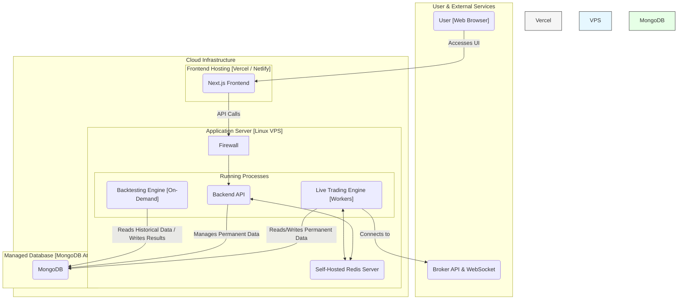

---

#### **1. Purpose**

This document defines the high-level architecture for the Algorithmic Trading Platform. It outlines the core components, their distinct responsibilities, and the interaction patterns between them. This design prioritizes performance, scalability, and resilience by separating concerns into distinct, independently operating domains.

#### **2. Core Architectural Principles**

*   **Separation of Concerns:** The system is divided into three primary domains: a **Management API**, a **Live Trading Engine**, and an **Analysis Engine (Backtester)**. Each has a single responsibility and operates independently.
*   **Hybrid Data Storage:** The system utilizes a dual-database approach to optimize for both speed and persistence.
    *   **MongoDB:** The single source of truth for all persistent, static data (configurations, historical records).
    *   **Redis:** The high-speed cache and state machine for all ephemeral, real-time operational data.
*   **Event-Driven Communication:** The live workers are decoupled and communicate through state changes in Redis (e.g., signal keys), not by calling each other directly. This enhances resilience and scalability.

#### **3. Architecture Diagram**

This diagram illustrates the hybrid cloud architecture, showing the co-location of the compute-intensive components and the use of managed services for data and frontend delivery.

#### **4. Component Breakdown**

| Component | Technology | Hosting | Core Responsibilities |
| :--- | :--- | :--- | :--- |
| **Frontend UI** | Next.js | Vercel / Netlify | - Provide the user interface for all strategy and backtest management. - Visualize live data and historical results. - Communicate exclusively with the Backend API. |
| **Backend API** | Python (FastAPI) | Process on VPS | - Manage all strategy configurations in MongoDB. - Implement the "write-through cache" pattern to keep Redis configs in sync. - Trigger on-demand Backtesting Engine processes. - Serve real-time dashboard data by reading from Redis. |
| **Live Trading Engine** | Python (Multiprocessing) | Background processes on VPS | - Run all 24/7 workers (Data Ingestion, Indicator, Evaluation, Execution). - Perform the complete live trading loop. - Use Redis for all high-frequency operations. - Archive completed trades to MongoDB. |
| **Backtesting Engine** | Python | On-demand process on VPS | - Read strategy configs and historical candle data **only from MongoDB**. - Simulate trade execution bar-by-bar. - Reuse shared logic libraries for indicators and evaluation. - Write detailed results and trade logs to a dedicated collection in **MongoDB**. |
| **Self-Hosted Redis** | Redis | Service on VPS | - Store all real-time state: live ticks, candle working sets, calculated indicators, active positions, and temporary signals. - Provide microsecond-level latency for the Live Trading Engine. |
| **Managed MongoDB** | MongoDB | MongoDB Atlas | - Act as the permanent, single source of truth for:   1. `strategies`: All user-defined configurations.   2. `historical_candles`: The complete archive of market data.   3. `trade_logs`: Records of all completed live/paper trades.   4. `backtest_results`: Detailed reports from backtesting runs. |

#### **5. Hosting and Deployment Strategy**

The architecture employs a **Hybrid Cloud Model** to maximize performance and minimize operational overhead:

1.  **Compute:** A single **Linux VPS** (e.g., DigitalOcean, Hetzner) will serve as the "Engine Room." It runs the Backend API, the Live Trading Engine, the on-demand Backtesting Engine, and the co-located Redis server for maximum performance.
2.  **Permanent Database:** A **Managed MongoDB Atlas Cluster** is used to offload the responsibility of database administration, backups, and reliability.
3.  **Frontend Delivery:** A **Vercel/Netlify** account will handle the automated deployment and global distribution of the web interface.

This model provides a professional, scalable, and cost-effective foundation for the platform.

---
